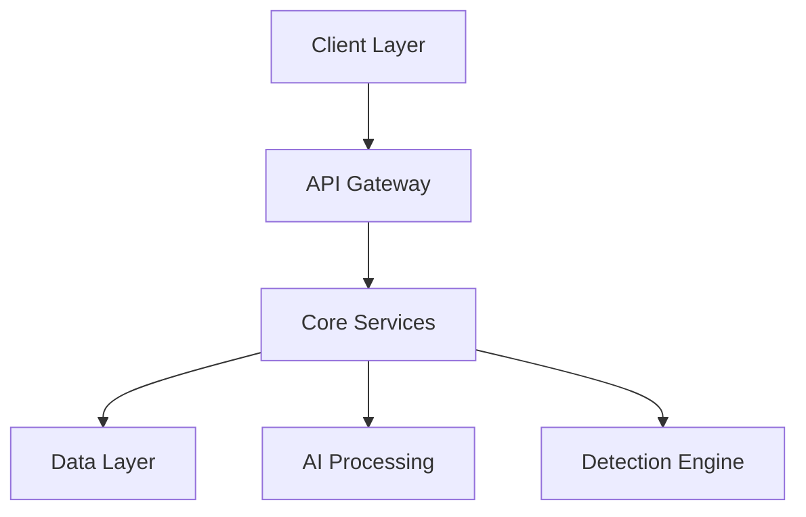

# AI-Driven Detection Engineering Platform

[](https://github.com/org/repo/actions)
[](https://snyk.io/test/github/org/repo)
[](https://codecov.io/gh/org/repo)
[](https://opensource.org/licenses/MIT)

An enterprise-grade platform for automating detection engineering workflows through advanced AI capabilities, enabling security teams to create, manage, and optimize security detections with unprecedented efficiency.

## 🚀 Features

### Intelligence Processing
- Multi-modal GenAI processing for threat intelligence sources
- Automated extraction from PDFs, URLs, and structured data (90% accuracy)
- Real-time processing with ≤2 minutes per intelligence report
- Advanced OCR capabilities for image-based content

### Detection Management
- AI-powered detection creation workbench
- Cross-platform translation supporting major SIEM platforms
- Version control and collaborative editing
- Automated validation and testing framework

### Coverage Analysis
- Automated MITRE ATT&CK framework mapping
- Real-time gap analysis and visualization
- Coverage scoring and recommendations
- Customizable coverage objectives

### Community Platform
- Public and private detection libraries
- Collaborative sharing and feedback system
- Detection rating and review mechanism
- Community-driven enhancement suggestions

## 🏗 Architecture

The platform implements a modern microservices architecture deployed on Kubernetes:



For detailed architecture documentation, see [Technical Documentation](https://docs.platform.com/architecture).

## 🛠 Development

### Prerequisites

- Kubernetes 1.27+
- Python 3.11+
- Node.js 18+
- Docker
- AWS CLI

### System Requirements

- CPU: 4 cores minimum
- Memory: 16GB RAM minimum
- Storage: 100GB SSD minimum
- Network: High-speed internet connection

### Quick Start

1. Clone the repository:
```bash
git clone https://github.com/org/repo
cd repo
```

2. Set up development environment:
```bash
make setup-dev
```

3. Start local services:
```bash
make start-local
```

4. Access the platform:
```
Frontend: http://localhost:3000
API: http://localhost:8000
Documentation: http://localhost:8080
```

For detailed setup instructions:
- [Backend Setup](src/backend/README.md)
- [Frontend Setup](src/web/README.md)

## 🚀 Deployment

### Cloud Infrastructure

The platform is optimized for AWS deployment with the following services:
- EKS for container orchestration
- RDS for relational databases
- DocumentDB for detection storage
- ElastiCache for performance optimization
- S3 for object storage

### Deployment Process

1. Configure AWS credentials:
```bash
aws configure
```

2. Deploy infrastructure:
```bash
terraform init
terraform apply
```

3. Deploy application:
```bash
make deploy-prod
```

## 📊 Monitoring

Comprehensive monitoring is implemented using DataDog:
- Application performance metrics
- Custom business metrics
- Error tracking and alerting
- User behavior analytics

## 🔒 Security

Security is implemented at multiple layers:
- TLS 1.3 encryption in transit
- AES-256 encryption at rest
- Role-based access control (RBAC)
- Multi-factor authentication (MFA)
- Regular security scanning and updates

For security-related concerns, please see our [Security Policy](SECURITY.md).

## 🤝 Contributing

We welcome contributions! Please see our [Contributing Guidelines](CONTRIBUTING.md) and [Code of Conduct](CODE_OF_CONDUCT.md).

## 📝 License

This project is licensed under the MIT License - see the [LICENSE](LICENSE) file for details.

## 🌟 Supported Platforms

### Cloud Providers
- AWS

### SIEM Platforms
- Splunk Enterprise
- Microsoft Sentinel
- Elastic Security

### Browsers
- Google Chrome
- Mozilla Firefox
- Microsoft Edge
- Safari

## 📞 Support

- Documentation: [https://docs.platform.com](https://docs.platform.com)
- Issues: [GitHub Issues](https://github.com/org/repo/issues)
- Enterprise Support: [support@platform.com](mailto:support@platform.com)

## ✨ Maintainers

Maintained by the Detection Engineering Team.

---

Version: 1.0.0 | Last Updated: 2024