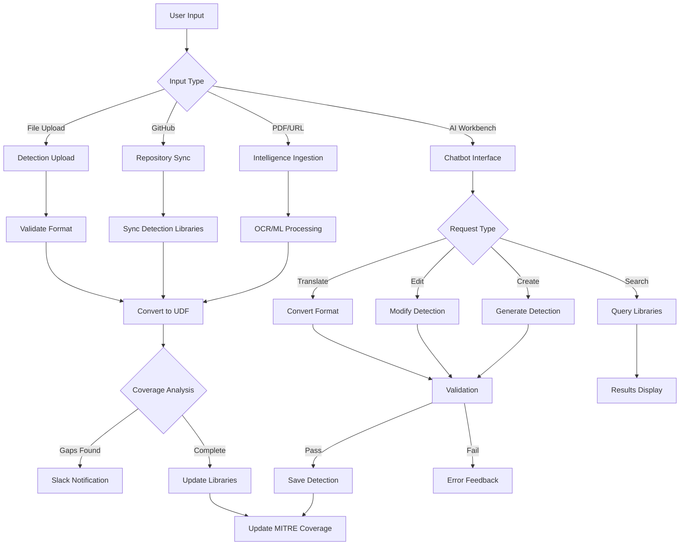
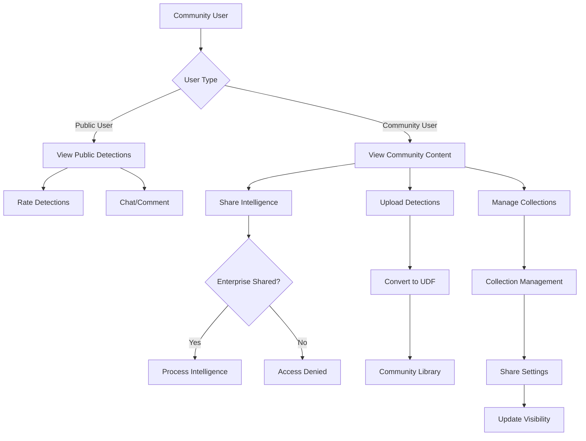
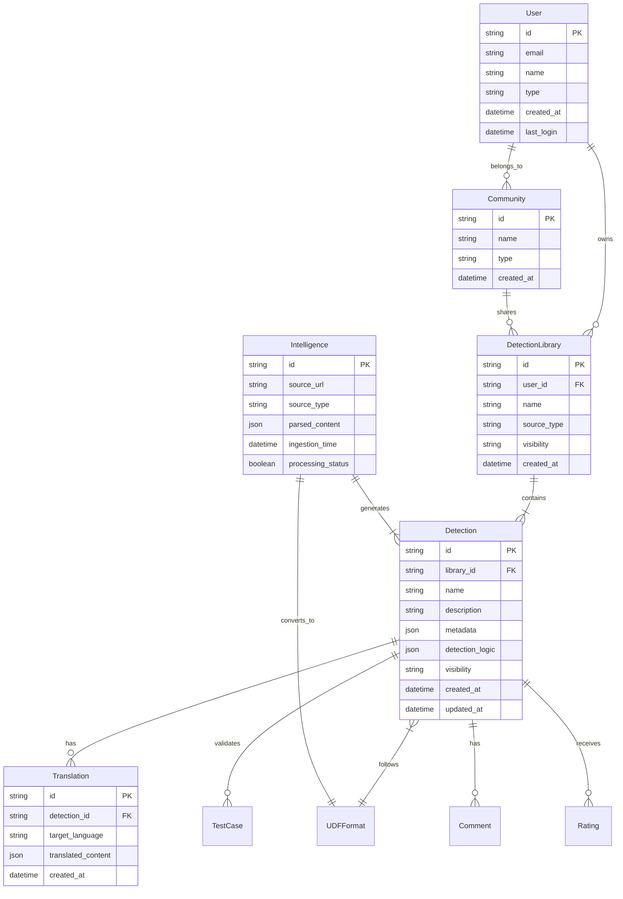
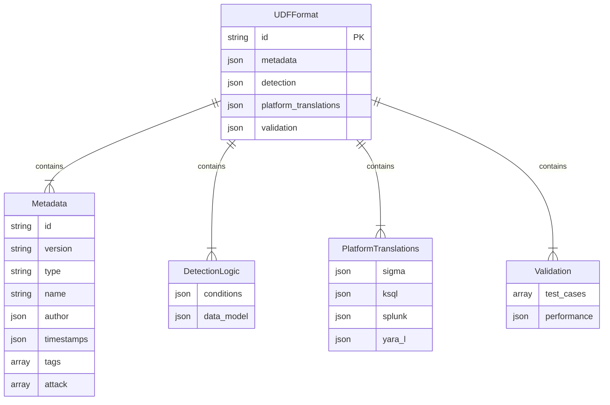
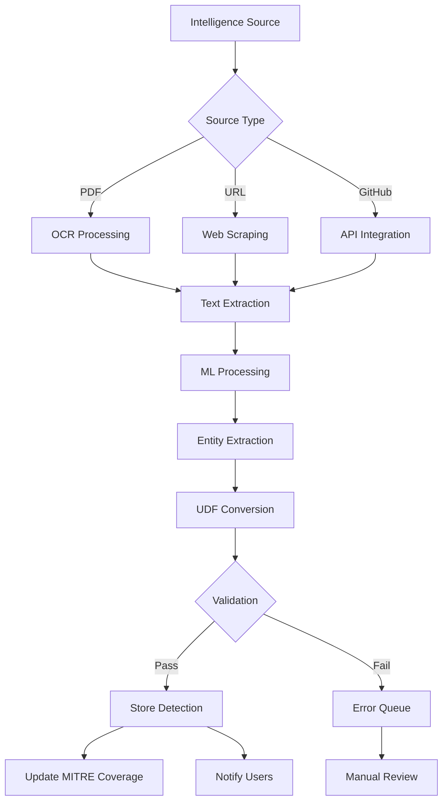
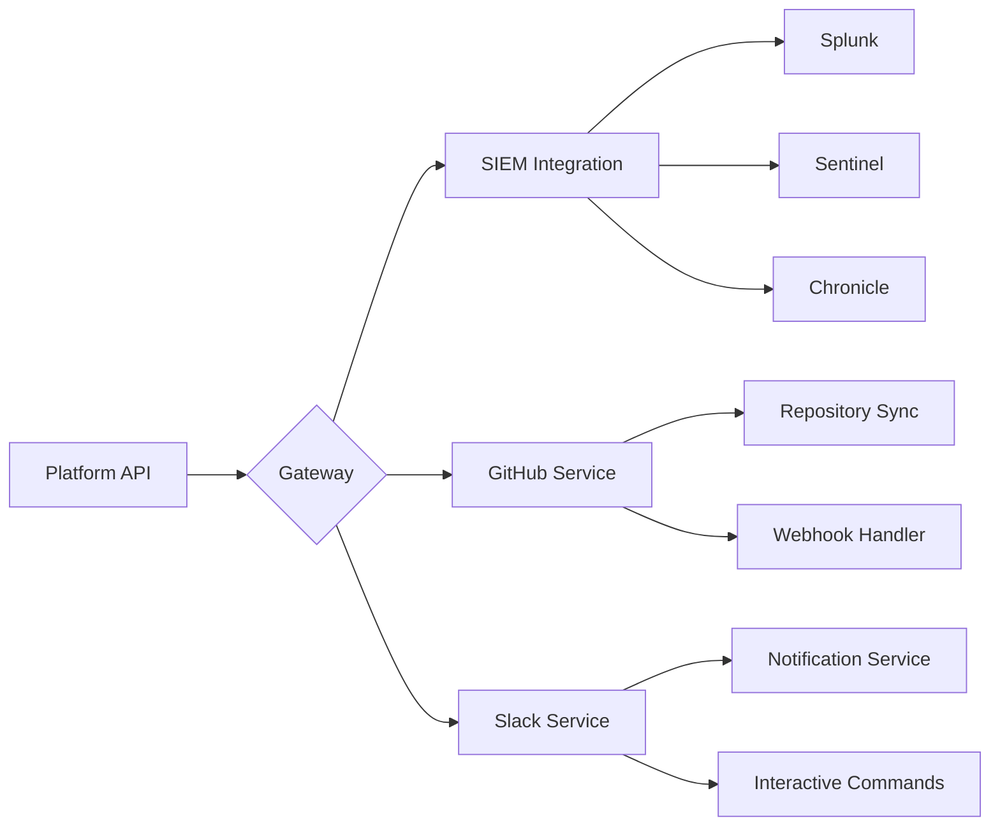

# Product Requirements Document (PRD)

# 1. INTRODUCTION

## 1.1 Purpose

This Product Requirements Document (PRD) specifies the requirements for an AI-driven Detection Engineering platform designed to automate and enhance the creation, management, and optimization of security detections. The document serves as a comprehensive guide for:

- Development and engineering teams implementing the system
- Product managers overseeing feature development
- Security architects ensuring compliance and integration capabilities
- Quality assurance teams validating system functionality
- Stakeholders evaluating project scope and deliverables

## 1.2 Scope

The AI-driven Detection Engineering platform is a comprehensive solution that transforms manual detection engineering workflows into an automated, intelligent system. The platform encompasses:

### Core Capabilities

- Automated ingestion and parsing of threat intelligence from multiple sources using multi-modal GenAI
- AI-powered detection creation and management through a conversational interface
- Detection coverage analysis and gap identification
- Cross-platform detection translation and validation
- Community-driven detection sharing and collaboration

### Key Benefits

- Reduced manual effort in detection engineering workflows
- Improved detection quality and coverage
- Standardized detection format across different security platforms
- Enhanced collaboration through community features
- Automated validation and testing against MITRE ATT&CK framework

### Target Environment

- Enterprise security operations teams
- Multi-tenant architecture supporting both community and enterprise editions
- Integration with existing security tools and platforms
- Web-based interface with API-first design
- Support for multiple detection languages and formats

# 2. PRODUCT DESCRIPTION

## 2.1 Product Perspective

The AI-driven Detection Engineering platform operates as a standalone system that integrates with existing security infrastructure. The system architecture consists of:

- Web-based frontend built with ReactJS
- RESTful API backend service
- Secure document storage system
- Machine learning and AI components for detection engineering
- Integration interfaces for:
  - Security Information and Event Management (SIEM) systems
  - Version control platforms (GitHub)
  - Communication tools (Slack)
  - Web browsers (Chrome Extension)

## 2.2 Product Functions

The platform provides the following core functions:

1. Intelligence Management

   - Automated ingestion from PDFs, URLs, and GitHub repositories
   - OCR and GenAI-powered parsing of threat intelligence
   - Conversion to Universal Detection Format (UDF)

2. Detection Engineering

   - AI-powered detection creation and management
   - Cross-platform detection translation
   - Detection testing and validation
   - Coverage analysis against MITRE ATT&CK framework

3. Community Features

   - Public and private detection sharing
   - Community-based collaboration
   - Detection rating and feedback
   - Community-specific detection libraries

4. Integration Capabilities

   - API-first architecture for programmatic access
   - SIEM platform integration
   - GitHub synchronization
   - Slack notifications
   - Chrome extension for web intelligence capture

## 2.3 User Characteristics

Primary user personas include:

1. Detection Engineers

   - Advanced technical expertise
   - Experience with SIEM platforms and detection languages
   - Focus on detection creation and optimization

2. Security Analysts

   - Intermediate technical knowledge
   - Regular interaction with detection systems
   - Emphasis on detection implementation and tuning

3. Community Members

   - Varying levels of expertise
   - Interest in sharing and collaborating
   - Focus on knowledge exchange

4. API Users

   - Technical developers
   - Integration specialists
   - Automation engineers

## 2.4 Constraints

1. Technical Constraints

   - Processing time limit of 2 minutes for intelligence reports
   - Support for specific detection languages (Yara-L, SIGMA, KQL, SPL)
   - Concurrent user limit of 100 users

2. Security Constraints

   - Encrypted data storage requirement
   - Secure API access controls
   - Multi-tenant data isolation

3. Operational Constraints

   - 99.9% uptime requirement
   - 95% minimum true positive rate for intelligence ingestion
   - Browser compatibility requirements

4. Regulatory Constraints

   - Data protection compliance
   - Audit logging requirements
   - Access control documentation

## 2.5 Assumptions and Dependencies

### Assumptions

1. Users have basic understanding of detection engineering concepts
2. Organizations have existing SIEM infrastructure and tooling
3. Internet connectivity for cloud-based features
4. Modern web browser availability

### Dependencies

1. External Services

   - GitHub API availability
   - Slack API services
   - SIEM platform APIs

2. Infrastructure

   - Cloud hosting services
   - Database systems
   - Storage systems

3. Third-party Components

   - OCR processing engine
   - Machine learning models
   - Authentication services

# 3. PROCESS FLOWCHART

# 4. FUNCTIONAL REQUIREMENTS

## 4.1 Intelligence Management

### ID: F-INT-001

### Description

System for automated ingestion and processing of threat intelligence from multiple sources.

### Priority: High

### Requirements

| ID | Requirement | Priority |
| --- | --- | --- |
| F-INT-001.1 | System shall support PDF document ingestion with OCR capabilities | High |
| F-INT-001.2 | System shall support URL-based intelligence ingestion | High |
| F-INT-001.3 | System shall process and parse intelligence within 2 minutes | High |
| F-INT-001.4 | System shall maintain 95% accuracy in intelligence extraction | High |
| F-INT-001.5 | System shall convert all intelligence into UDF JSON format | High |
| F-INT-001.6 | System shall support automated ingestion from top 1000 threat intelligence blogs | Medium |
| F-INT-001.7 | System shall provide Chrome extension for web intelligence capture | Medium |

## 4.2 Detection Engineering Workbench

### ID: F-WB-001

### Description

AI-powered chatbot interface for detection creation and management.

### Priority: High

### Requirements

| ID | Requirement | Priority |
| --- | --- | --- |
| F-WB-001.1 | System shall provide conversational interface for detection creation | High |
| F-WB-001.2 | System shall support detection editing and modification | High |
| F-WB-001.3 | System shall enable detection search functionality | High |
| F-WB-001.4 | System shall provide threat actor intelligence analysis | High |
| F-WB-001.5 | System shall validate detection syntax and logic | High |
| F-WB-001.6 | System shall support batch detection operations | Medium |
| F-WB-001.7 | System shall provide detection optimization recommendations | Medium |

## 4.3 Detection Translation

### ID: F-TR-001

### Description

Cross-platform detection translation capabilities.

### Priority: High

### Requirements

| ID | Requirement | Priority |
| --- | --- | --- |
| F-TR-001.1 | System shall support Yara-L translation | High |
| F-TR-001.2 | System shall support SIGMA translation | High |
| F-TR-001.3 | System shall support KQL translation | High |
| F-TR-001.4 | System shall support SPL translation | High |
| F-TR-001.5 | System shall provide translation failure explanations | High |
| F-TR-001.6 | System shall maintain detection fidelity during translation | High |
| F-TR-001.7 | System shall validate translated detections | High |

## 4.4 Detection Libraries

### ID: F-LIB-001

### Description

Management of detection collections and individual detections.

### Priority: High

### Requirements

| ID | Requirement | Priority |
| --- | --- | --- |
| F-LIB-001.1 | System shall support hierarchical detection organization | High |
| F-LIB-001.2 | System shall enable GitHub repository synchronization | High |
| F-LIB-001.3 | System shall support file-based detection import | High |
| F-LIB-001.4 | System shall maintain private/public detection separation | High |
| F-LIB-001.5 | System shall provide detection version control | High |
| F-LIB-001.6 | System shall support detection metadata management | Medium |
| F-LIB-001.7 | System shall enable detection tagging and categorization | Medium |

## 4.5 Community Features

### ID: F-COM-001

### Description

Community-based detection sharing and collaboration capabilities.

### Priority: High

### Requirements

| ID | Requirement | Priority |
| --- | --- | --- |
| F-COM-001.1 | System shall support public and community user types | High |
| F-COM-001.2 | System shall enable community-based detection sharing | High |
| F-COM-001.3 | System shall support detection rating and feedback | High |
| F-COM-001.4 | System shall provide community invitation system | High |
| F-COM-001.5 | System shall enable detection commenting | Medium |
| F-COM-001.6 | System shall support community-specific libraries | Medium |
| F-COM-001.7 | System shall provide community activity notifications | Medium |

## 4.6 Integration Capabilities

### ID: F-INT-002

### Description

External system integration and API capabilities.

### Priority: High

### Requirements

| ID | Requirement | Priority |
| --- | --- | --- |
| F-INT-002.1 | System shall provide RESTful API access | High |
| F-INT-002.2 | System shall support GitHub integration | High |
| F-INT-002.3 | System shall enable Slack notifications | High |
| F-INT-002.4 | System shall provide Chrome extension functionality | Medium |
| F-INT-002.5 | System shall support SIEM platform integration | Medium |
| F-INT-002.6 | System shall maintain API documentation | Medium |
| F-INT-002.7 | System shall provide OAuth authentication support | Low |

# 5. NON-FUNCTIONAL REQUIREMENTS

## 5.1 Performance Requirements

| ID | Requirement | Target Metric |
| --- | --- | --- |
| NFR-P-001 | Intelligence processing time | ≤ 2 minutes per report |
| NFR-P-002 | API response time | ≤ 500ms for 95% of requests |
| NFR-P-003 | Detection translation time | ≤ 5 seconds per detection |
| NFR-P-004 | Maximum concurrent users | 100 users |
| NFR-P-005 | Database query response time | ≤ 200ms for 95% of queries |
| NFR-P-006 | File upload size limit | ≤ 50MB per file |
| NFR-P-007 | Memory usage | ≤ 4GB per application instance |

## 5.2 Safety Requirements

| ID | Requirement | Description |
| --- | --- | --- |
| NFR-S-001 | Data backup frequency | Hourly incremental, daily full backup |
| NFR-S-002 | Backup retention period | 30 days minimum |
| NFR-S-003 | Disaster recovery time | ≤ 4 hours RTO (Recovery Time Objective) |
| NFR-S-004 | Data loss prevention | ≤ 15 minutes RPO (Recovery Point Objective) |
| NFR-S-005 | Failover capability | Automatic failover to secondary region |
| NFR-S-006 | System state monitoring | Real-time monitoring with alerts |
| NFR-S-007 | Data validation | Input validation for all user-submitted data |

## 5.3 Security Requirements

| ID | Requirement | Description |
| --- | --- | --- |
| NFR-SEC-001 | Authentication | Multi-factor authentication support |
| NFR-SEC-002 | Authorization | Role-based access control (RBAC) |
| NFR-SEC-003 | Data encryption | AES-256 encryption at rest |
| NFR-SEC-004 | Transport security | TLS 1.3 for all communications |
| NFR-SEC-005 | API security | OAuth 2.0 and API key authentication |
| NFR-SEC-006 | Session management | 30-minute session timeout |
| NFR-SEC-007 | Audit logging | Comprehensive audit trail of all actions |

## 5.4 Quality Requirements

### 5.4.1 Availability

| ID | Requirement | Target Metric |
| --- | --- | --- |
| NFR-Q-001 | System uptime | 99.9% availability |
| NFR-Q-002 | Planned maintenance window | ≤ 4 hours per month |
| NFR-Q-003 | Service degradation notification | ≥ 24 hours advance notice |

### 5.4.2 Maintainability

| ID | Requirement | Description |
| --- | --- | --- |
| NFR-Q-004 | Code documentation | Complete API and code documentation |
| NFR-Q-005 | Version control | Git-based version control system |
| NFR-Q-006 | Deployment automation | CI/CD pipeline with automated testing |

### 5.4.3 Usability

| ID | Requirement | Target Metric |
| --- | --- | --- |
| NFR-Q-007 | User interface response | ≤ 100ms for UI interactions |
| NFR-Q-008 | Browser compatibility | Support latest versions of Chrome, Firefox, Safari |
| NFR-Q-009 | Mobile responsiveness | Responsive design for tablet devices |

### 5.4.4 Scalability

| ID | Requirement | Target Metric |
| --- | --- | --- |
| NFR-Q-010 | Horizontal scaling | Support for auto-scaling up to 10 nodes |
| NFR-Q-011 | Database scaling | Support for database sharding |
| NFR-Q-012 | Storage scaling | Automatic storage expansion up to 1TB |

### 5.4.5 Reliability

| ID | Requirement | Target Metric |
| --- | --- | --- |
| NFR-Q-013 | Mean time between failures | ≥ 720 hours |
| NFR-Q-014 | Detection accuracy | ≥ 95% true positive rate |
| NFR-Q-015 | System recovery | Self-healing for common failures |

## 5.5 Compliance Requirements

| ID | Requirement | Description |
| --- | --- | --- |
| NFR-C-001 | Data protection | GDPR compliance for EU users |
| NFR-C-002 | Access controls | SOC 2 Type II compliance |
| NFR-C-003 | Audit requirements | Maintain audit logs for 1 year |
| NFR-C-004 | Data residency | Regional data storage compliance |
| NFR-C-005 | Security standards | NIST Cybersecurity Framework alignment |
| NFR-C-006 | Privacy policy | Clear privacy policy and data handling documentation |
| NFR-C-007 | Export controls | Compliance with export control regulations |

# 6. DATA REQUIREMENTS

## 6.1 Data Models

### 6.1.1 Core Entity Relationships

### 6.1.2 UDF Schema Structure

## 6.2 Data Storage

### 6.2.1 Storage Requirements

| Data Type | Storage System | Retention Period | Backup Frequency |
| --- | --- | --- | --- |
| User Data | PostgreSQL | Indefinite | Daily |
| Detections | MongoDB | Indefinite | Daily |
| Intelligence | MongoDB | 90 days | Daily |
| Audit Logs | Elasticsearch | 365 days | Daily |
| File Attachments | S3-compatible Object Storage | Indefinite | Daily |
| Cache Data | Redis | 24 hours | None |

### 6.2.2 Backup and Recovery

| Requirement | Specification |
| --- | --- |
| Backup Type | Multi-region, encrypted snapshots |
| Recovery Point Objective (RPO) | 15 minutes |
| Recovery Time Objective (RTO) | 4 hours |
| Backup Retention | 30 days |
| Backup Encryption | AES-256 |
| Geographic Redundancy | 3 regions minimum |

## 6.3 Data Processing

### 6.3.1 Intelligence Processing Flow

### 6.3.2 Data Security Controls

| Security Layer | Implementation |
| --- | --- |
| Data at Rest | AES-256 encryption |
| Data in Transit | TLS 1.3 |
| Access Control | Role-based with JWT |
| API Security | OAuth 2.0 + API Keys |
| Data Isolation | Tenant-level partitioning |
| Audit | Comprehensive action logging |
| PII Protection | Data masking and encryption |

### 6.3.3 Data Processing Requirements

| Process Type | Requirement |
| --- | --- |
| Intelligence Ingestion | ≤ 2 minutes processing time |
| Detection Translation | ≤ 5 seconds per detection |
| Batch Processing | ≤ 1000 detections per hour |
| Search Indexing | Near real-time (≤ 10 seconds) |
| Cache Invalidation | Immediate on update |
| Data Synchronization | ≤ 1 minute lag between regions |

# 7. EXTERNAL INTERFACES

## 7.1 User Interfaces

### 7.1.1 Web Application Interface

| Component | Description | Requirements |
| --- | --- | --- |
| AI Workbench | Chatbot interface for detection management | - Conversational UI with message history - Code editor with syntax highlighting - Real-time validation feedback |
| Detection Libraries | Interface for managing detection collections | - Hierarchical folder structure - Drag-and-drop organization - Search and filter capabilities |
| Intelligence Dashboard | Overview of processed intelligence | - Status indicators for processing - Coverage analysis visualization - MITRE ATT&CK mapping display |
| Settings Panel | Configuration interface | - User/team management - Integration settings - Notification preferences |

### 7.1.2 Chrome Extension

| Feature | Description | Requirements |
| --- | --- | --- |
| Toolbar Button | Quick access to capture functionality | - Visual feedback for capture status - Context menu integration |
| Capture Interface | Intelligence capture overlay | - Selection highlighting - Capture preview - Processing status indicator |
| Settings Panel | Extension configuration | - Authentication management - Capture preferences - Workspace selection |

## 7.2 Software Interfaces

### 7.2.1 SIEM Integration

| System | Interface Type | Requirements |
| --- | --- | --- |
| Splunk | REST API | - Custom app installation - Detection push/pull capability - Field mapping configuration |
| Microsoft Sentinel | Graph API | - OAuth authentication - KQL translation support - Workspace management |
| Chronicle | API v2 | - YARA-L rule deployment - Detection synchronization - Status monitoring |

### 7.2.2 External Services

| Service | Interface Type | Requirements |
| --- | --- | --- |
| GitHub | REST API v3 | - Repository synchronization - Webhook support - Branch management |
| Slack | Web API | - Channel messaging - Interactive components - OAuth app installation |
| MITRE ATT&CK | REST API | - Technique lookup - Tactic mapping - Sub-technique resolution |

## 7.3 Communication Interfaces

### 7.3.1 API Protocols

| Protocol | Usage | Requirements |
| --- | --- | --- |
| HTTPS | All external communication | - TLS 1.3 - Certificate validation - Perfect forward secrecy |
| WebSocket | Real-time updates | - Secure WebSocket (WSS) - Heartbeat mechanism - Auto-reconnection |
| GraphQL | API queries | - Schema validation - Query depth limiting - Rate limiting |

### 7.3.2 Data Formats

| Format | Usage | Requirements |
| --- | --- | --- |
| JSON | Primary data exchange | - Schema validation - UTF-8 encoding - Compression support |
| Protocol Buffers | High-performance data | - Version compatibility - Schema evolution - Binary encoding |
| YAML | Configuration files | - YAML 1.2 compliance - Template support - Environment variable substitution |

### 7.3.3 Integration Endpoints

# 8. APPENDICES

## 8.1 GLOSSARY

| Term | Definition |
| --- | --- |
| Detection Engineering | The process of creating, testing, and maintaining security detection rules |
| Universal Detection Format (UDF) | A standardized JSON format for representing security detections across different platforms |
| Detection Library | A collection of organized security detections with metadata and version control |
| Coverage Analysis | Assessment of security detection coverage against known threats and frameworks |
| True Positive Rate | The percentage of correct positive detections out of all positive detections |
| Detection Translation | The process of converting detections between different query languages |
| Intelligence Ingestion | The automated process of consuming and parsing threat intelligence from various sources |

## 8.2 ACRONYMS

| Acronym | Definition |
| --- | --- |
| API | Application Programming Interface |
| CTI | Cyber Threat Intelligence |
| KQL | Kusto Query Language |
| OCR | Optical Character Recognition |
| PRD | Product Requirements Document |
| RBAC | Role-Based Access Control |
| SIEM | Security Information and Event Management |
| SPL | Search Processing Language |
| UDF | Universal Detection Format |
| UI | User Interface |
| URL | Uniform Resource Locator |

## 8.3 ADDITIONAL REFERENCES

### 8.3.1 Detection Languages Documentation

| Language | Reference URL |
| --- | --- |
| Yara-L | https://cloud.google.com/chronicle/docs/detection/yara-l-2-0-syntax |
| SIGMA | https://sigmahq.io/docs/basics/rules.html |
| KQL | https://learn.microsoft.com/en-us/sharepoint/dev/general-development/keyword-query-language-kql-syntax-reference |
| SPL | https://docs.splunk.com/Documentation/SplunkCloud/latest/SearchReference/UnderstandingSPLsyntax |

### 8.3.2 Intelligence Sources

| Source | URL |
| --- | --- |
| Microsoft Security Blog | https://www.microsoft.com/en-us/security/blog/ |
| Palo Alto Unit 42 | https://unit42.paloaltonetworks.com/ |
| Sentinel One Labs | https://www.sentinelone.com/labs/ |
| Wiz Threats | https://threats.wiz.io/ |
| Crowdstrike Blog | https://www.crowdstrike.com/blog/category/threat-intel-research/ |
| SIGMA HQ | https://github.com/SigmaHQ/sigma |

## 8.4 FEATURE COMPARISON MATRIX

### 8.4.1 Edition Capabilities

| Feature | Community Edition | Enterprise Edition |
| --- | --- | --- |
| Discover | ✅ | ✅ |
| Create | ✅ | ✅ |
| Transform | ❌ | ✅ |
| Translate | ❌ | ✅ |
| Coverage | ❌ | ✅ |
| Enrich | ❌ | ✅ |
| Optimize | ❌ | ✅ |
| Explain | ❌ | ✅ |
| Report | ❌ | ✅ |
| Triage | ❌ | ✅ |
| Correlate | ❌ | ✅ |

### 8.4.2 User Type Permissions

| Capability | Public User | Community User | Enterprise User |
| --- | --- | --- | --- |
| View Public Detections | ✅ | ✅ | ✅ |
| Rate Detections | ✅ | ✅ | ✅ |
| Comment on Detections | ✅ | ✅ | ✅ |
| Upload Detections | ❌ | ✅ | ✅ |
| Share Intelligence | ❌ | ❌ | ✅ |
| Access Advanced Features | ❌ | ❌ | ✅ |
| Invite Community Members | ❌ | ✅ | ✅ |
| Manage Private Libraries | ❌ | ✅ | ✅ |