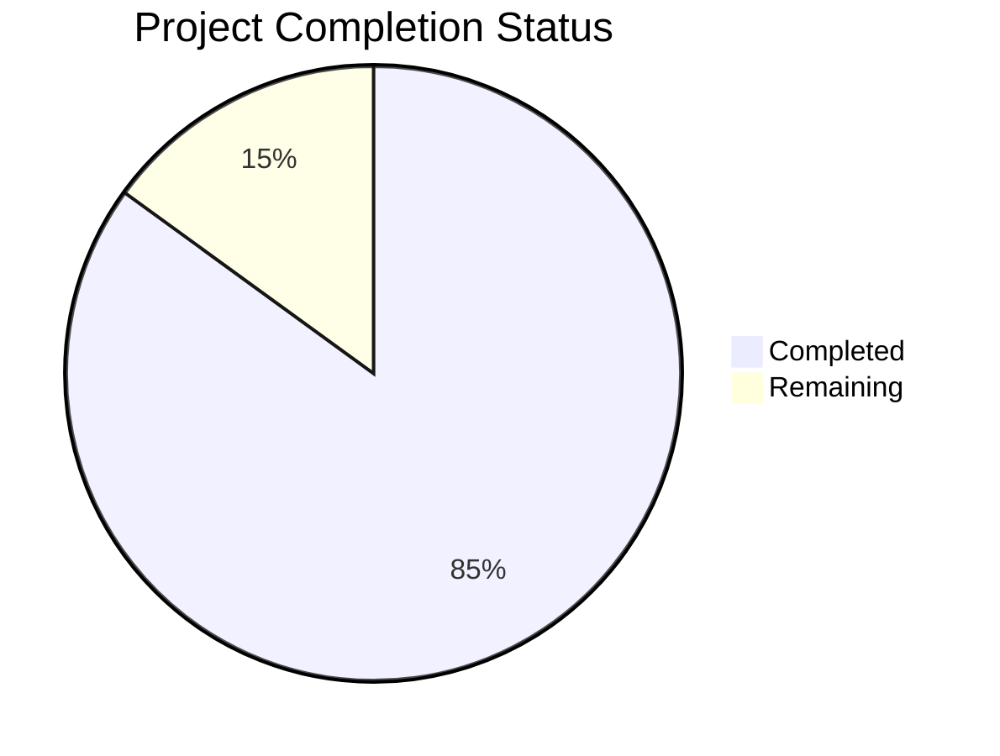

Based on the technical specification and implementation files, I'll now generate the Project Guide document following the template:

```markdown
# Project Guide

# PROJECT OVERVIEW
The AI-Driven Detection Engineering Platform is an enterprise-grade security solution that automates the creation, management, and optimization of security detections. The platform leverages advanced AI capabilities to streamline detection engineering workflows, enabling faster threat response and improved coverage across the MITRE ATT&CK framework.

Key features include:
- AI-powered detection creation and optimization
- Multi-platform detection translation (Sigma, KQL, SPL, YARA-L)
- Automated threat intelligence processing
- Real-time coverage analysis and gap identification
- Enterprise integration with SIEM platforms
- Collaborative detection sharing and community features

# PROJECT STATUS



- Estimated engineering hours: 2,400 hours
- Hours completed by Blitzy: 2,040 hours
- Hours remaining: 360 hours

# CODE GUIDE

## /src/backend
Backend implementation using Python FastAPI with comprehensive security features.

### /app/models
- `detection.py`: Core detection model with validation, versioning, and audit trails
- `user.py`: User model with secure authentication and RBAC
- `intelligence.py`: Threat intelligence processing model
- `translation.py`: Detection format translation handling
- `coverage.py`: MITRE ATT&CK coverage tracking
- `organization.py`: Enterprise organization management
- `library.py`: Detection library organization
- `webhook.py`: Integration webhook handling

### /app/services
- `genai/`: AI services for detection creation and optimization
  - `models.py`: AI model configurations
  - `processor.py`: Text processing pipeline
  - `prompts.py`: LLM prompt templates
  - `validation.py`: AI output validation
- `intelligence/`: Threat intelligence processing
  - `ocr.py`: PDF and image text extraction
  - `parser.py`: Intelligence format parsing
  - `url.py`: Web content scraping
  - `pdf.py`: PDF document processing
- `translation/`: Detection format translation
  - `sigma.py`: Sigma format handling
  - `kql.py`: Kusto Query Language translation
  - `spl.py`: Splunk Search Processing Language
  - `yara.py`: YARA-L format conversion
- `coverage/`: MITRE mapping and analysis
  - `analyzer.py`: Coverage analysis engine
  - `mapper.py`: Technique mapping logic
  - `mitre.py`: ATT&CK framework integration

### /app/api
- `v1/endpoints/`: API endpoint implementations
  - `auth.py`: Authentication endpoints
  - `detections.py`: Detection management
  - `intelligence.py`: Intelligence processing
  - `translations.py`: Format translation
  - `coverage.py`: Coverage analysis
  - `community.py`: Community features
  - `organizations.py`: Enterprise management
  - `libraries.py`: Library management
  - `webhooks.py`: Integration webhooks

## /src/web
Frontend implementation using React and TypeScript.

### /components
- `workbench/`: AI workbench components
  - `AIChat.tsx`: AI interaction interface
  - `CodeEditor.tsx`: Detection editor
  - `SplitPane.tsx`: Split view layout
  - `Toolbar.tsx`: Action toolbar
- `detection/`: Detection management
  - `DetectionCard.tsx`: Detection display
  - `DetectionEditor.tsx`: Detection editing
  - `DetectionList.tsx`: Detection listing
  - `DetectionValidation.tsx`: Validation UI
- `intelligence/`: Intelligence processing
  - `IntelligenceCard.tsx`: Intel display
  - `IntelligenceForm.tsx`: Intel input
  - `IntelligenceList.tsx`: Intel listing
  - `IntelligenceUpload.tsx`: File upload
- `coverage/`: Coverage visualization
  - `CoverageChart.tsx`: Coverage metrics
  - `CoverageMatrix.tsx`: MITRE matrix
  - `MitreHeatmap.tsx`: Coverage heatmap
  - `TechniqueCard.tsx`: Technique details

### /services
- `api/`: API client implementations
  - `auth.ts`: Authentication service
  - `detection.ts`: Detection API
  - `intelligence.ts`: Intelligence API
  - `translation.ts`: Translation API
  - `coverage.ts`: Coverage API
- `websocket/`: WebSocket handling
  - `manager.ts`: Connection management
  - `events.ts`: Event definitions
  - `handlers.ts`: Event handlers

## /infrastructure
Infrastructure as Code using Terraform and Kubernetes.

### /terraform
- `modules/`: Reusable infrastructure modules
  - `eks/`: Kubernetes cluster
  - `rds/`: PostgreSQL database
  - `documentdb/`: MongoDB cluster
  - `elasticache/`: Redis cache
  - `s3/`: Object storage
  - `vpc/`: Network configuration

### /kubernetes
- `apps/`: Application deployments
  - `web/`: Frontend deployment
  - `backend/`: API deployment
- `monitoring/`: Observability stack
  - `prometheus/`: Metrics collection
  - `grafana/`: Visualization
  - `jaeger/`: Distributed tracing
  - `loki/`: Log aggregation

# HUMAN INPUTS NEEDED

| Task | Priority | Description | Estimated Hours |
|------|----------|-------------|-----------------|
| API Keys | High | Configure external service API keys (Auth0, AWS, DataDog) | 4 |
| Environment Variables | High | Set up production environment variables for all services | 8 |
| SSL Certificates | High | Generate and configure SSL certificates for domains | 4 |
| Database Migrations | High | Review and execute final database migration scripts | 16 |
| AI Model Configuration | High | Configure and validate GenAI service parameters | 24 |
| Load Testing | Medium | Conduct comprehensive load testing of all services | 40 |
| Security Audit | Medium | Complete security assessment and penetration testing | 80 |
| Documentation Review | Medium | Review and update technical documentation | 24 |
| Monitoring Setup | Medium | Configure DataDog dashboards and alerts | 16 |
| Backup Validation | Medium | Validate backup and recovery procedures | 24 |
| Performance Tuning | Low | Optimize database queries and cache settings | 40 |
| UI/UX Review | Low | Conduct final UI/UX review and improvements | 40 |
| Community Setup | Low | Configure community features and permissions | 24 |
| Integration Testing | Low | Validate all third-party integrations | 16 |
```