# Technical Specifications

# 1. INTRODUCTION

## 1.1 EXECUTIVE SUMMARY

The AI-Driven Detection Engineering platform represents a transformative solution for enterprise security operations, automating the traditionally manual processes of creating, managing, and optimizing security detections. By leveraging advanced AI capabilities, the system streamlines detection engineering workflows for security teams, enabling faster threat response and improved coverage across the MITRE ATT&CK framework. Primary stakeholders include Detection Engineers and Security Analysts at large enterprises, with the platform delivering an estimated 60-80% reduction in manual detection engineering effort while improving detection quality and coverage.

## 1.2 SYSTEM OVERVIEW

### Project Context

| Aspect | Description |
|--------|-------------|
| Market Position | Enterprise-grade detection engineering automation platform with community edition |
| Current Limitations | Manual detection creation, inconsistent formats, limited coverage visibility |
| Enterprise Integration | Seamless integration with existing SIEM platforms, GitHub repositories, and communication tools |

### High-Level Description

| Component | Implementation |
|-----------|---------------|
| Intelligence Processing | Multi-modal GenAI for automated parsing of PDFs, URLs, and structured data |
| Detection Management | AI-powered workbench with cross-platform translation capabilities |
| Coverage Analysis | Automated mapping against MITRE ATT&CK framework with gap identification |
| Community Platform | Collaborative detection sharing and feedback system |

### Success Criteria

| Metric | Target |
|--------|---------|
| Intelligence Processing Time | ≤ 2 minutes per report |
| Detection Translation Accuracy | ≥ 95% success rate |
| System Availability | 99.9% uptime |
| User Adoption | 80% active usage within 3 months |

## 1.3 SCOPE

### In-Scope Elements

#### Core Features

| Category | Components |
|----------|------------|
| Detection Sources | - CTI Processing<br>- PDF/URL Ingestion<br>- GitHub Integration<br>- File Upload Support |
| Workbench Capabilities | - AI-Powered Creation<br>- Cross-Platform Translation<br>- Coverage Analysis<br>- Detection Testing |
| Community Features | - Public/Private Libraries<br>- Collaborative Sharing<br>- Detection Rating<br>- Community Management |

#### Implementation Boundaries

| Boundary Type | Coverage |
|--------------|----------|
| User Groups | - Enterprise Detection Engineers<br>- Community Contributors<br>- API Integration Users |
| Geographic Coverage | - Global Cloud Deployment<br>- Multi-Region Data Storage |
| Data Domains | - Threat Intelligence<br>- Detection Rules<br>- MITRE ATT&CK Mappings |

### Out-of-Scope Elements

| Category | Excluded Elements |
|----------|------------------|
| Features | - Custom SIEM Development<br>- Threat Hunting Workflows<br>- Incident Response Automation |
| Integrations | - Legacy SIEM Platforms<br>- Custom Protocol Support<br>- Direct Hardware Integration |
| Use Cases | - Real-time Detection Execution<br>- Threat Intelligence Generation<br>- Vulnerability Management |
| Future Considerations | - Machine Learning Model Training<br>- Custom Detection Language Development<br>- Advanced Analytics Dashboard |

# 2. SYSTEM ARCHITECTURE

## 2.1 High-Level Architecture

The AI-Driven Detection Engineering platform follows a microservices architecture pattern, organized around business capabilities and deployed as containerized services.

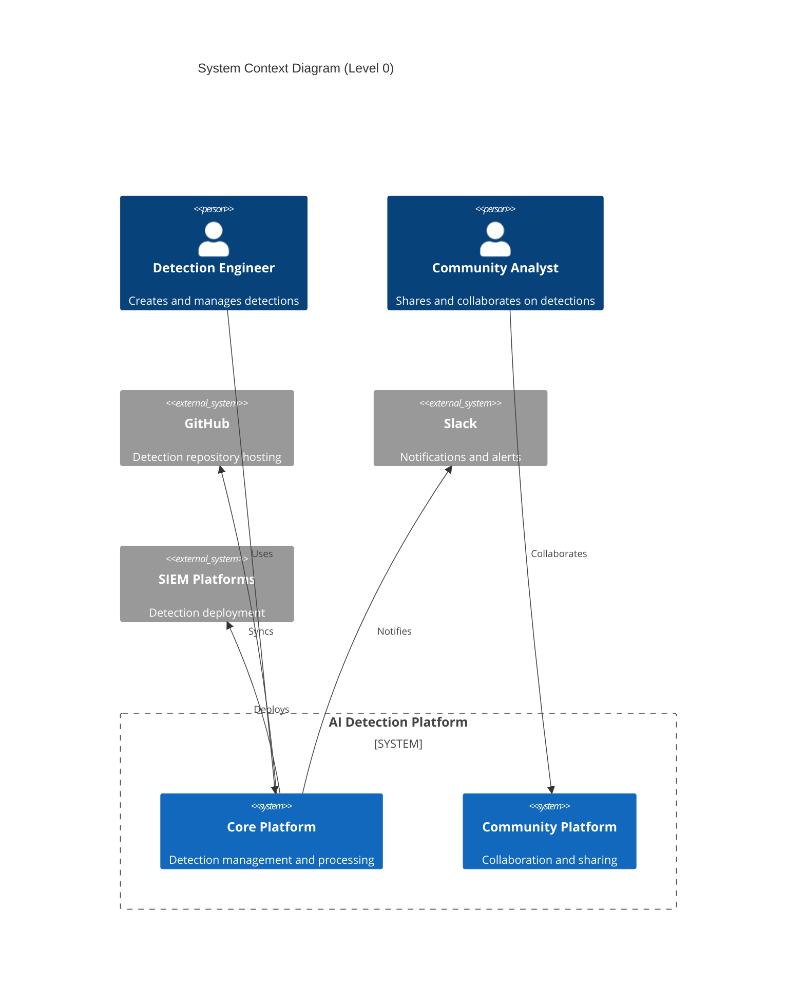

### Container Architecture

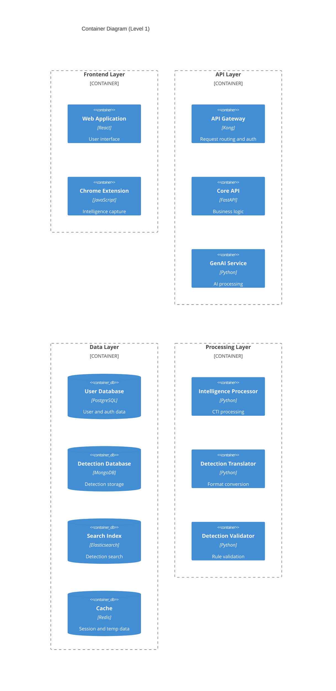

## 2.2 Component Details

### Core Components

| Component | Technology | Purpose | Scaling Strategy |
|-----------|------------|---------|------------------|
| Web Application | React + TypeScript | User interface and interaction | Horizontal with CDN |
| API Gateway | Kong | Request routing, auth, rate limiting | Horizontal with sticky sessions |
| Core API | FastAPI | Business logic and orchestration | Horizontal with load balancing |
| GenAI Service | Python + Transformers | AI-powered detection creation | Vertical with GPU support |
| Intelligence Processor | Python + OCR | CTI ingestion and parsing | Horizontal with queue |
| Detection Translator | Python | Cross-platform translation | Horizontal with queue |

### Data Storage

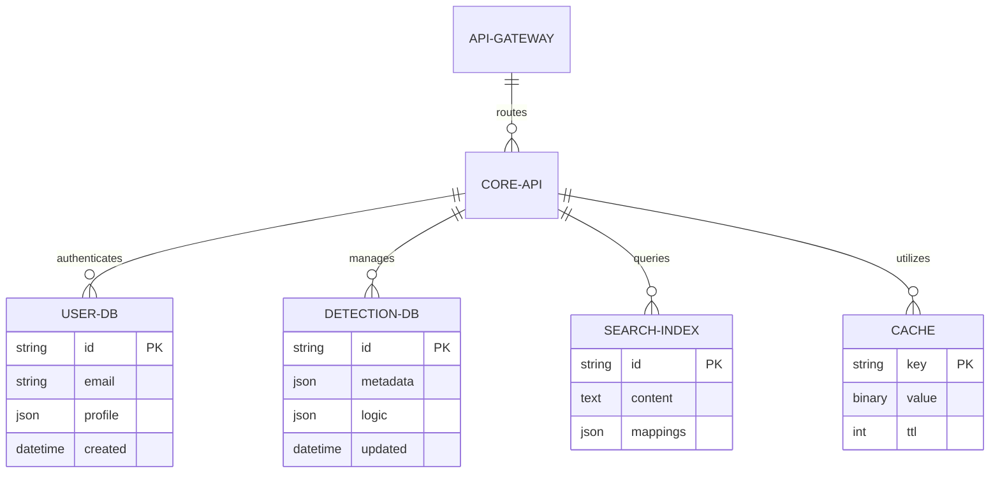

## 2.3 Technical Decisions

### Architecture Patterns

| Pattern | Implementation | Justification |
|---------|---------------|---------------|
| Microservices | Containerized services | Scalability and isolation |
| Event-Driven | Apache Kafka | Async processing and decoupling |
| CQRS | Separate read/write paths | Performance optimization |
| API Gateway | Kong | Security and routing |
| Circuit Breaker | Resilience4j | Fault tolerance |

### Data Flow Architecture

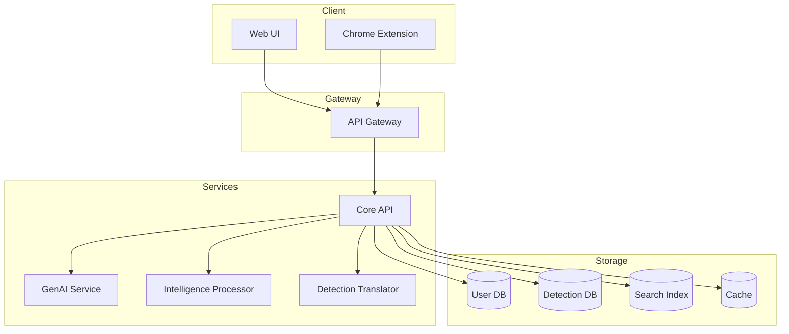

## 2.4 Cross-Cutting Concerns

### Monitoring and Observability

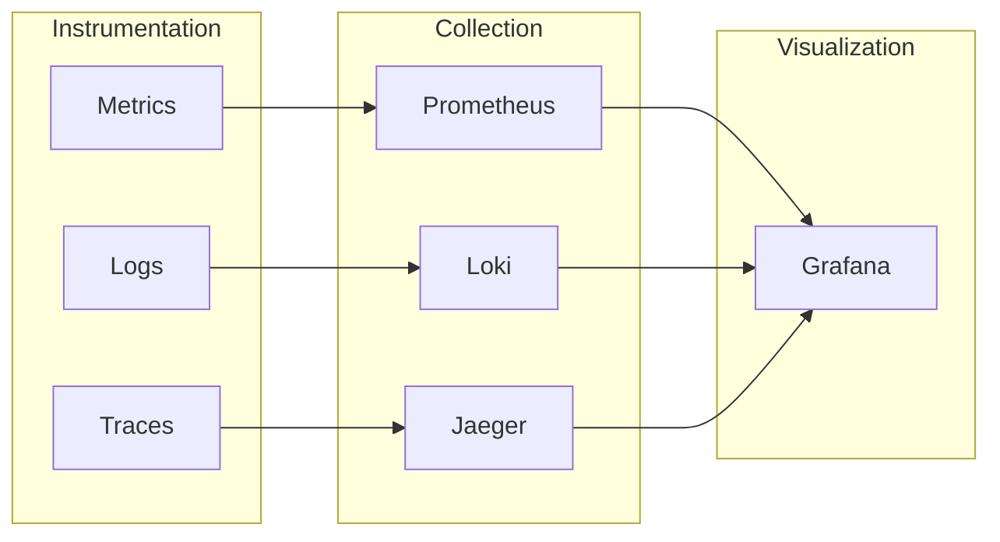

### Security Architecture

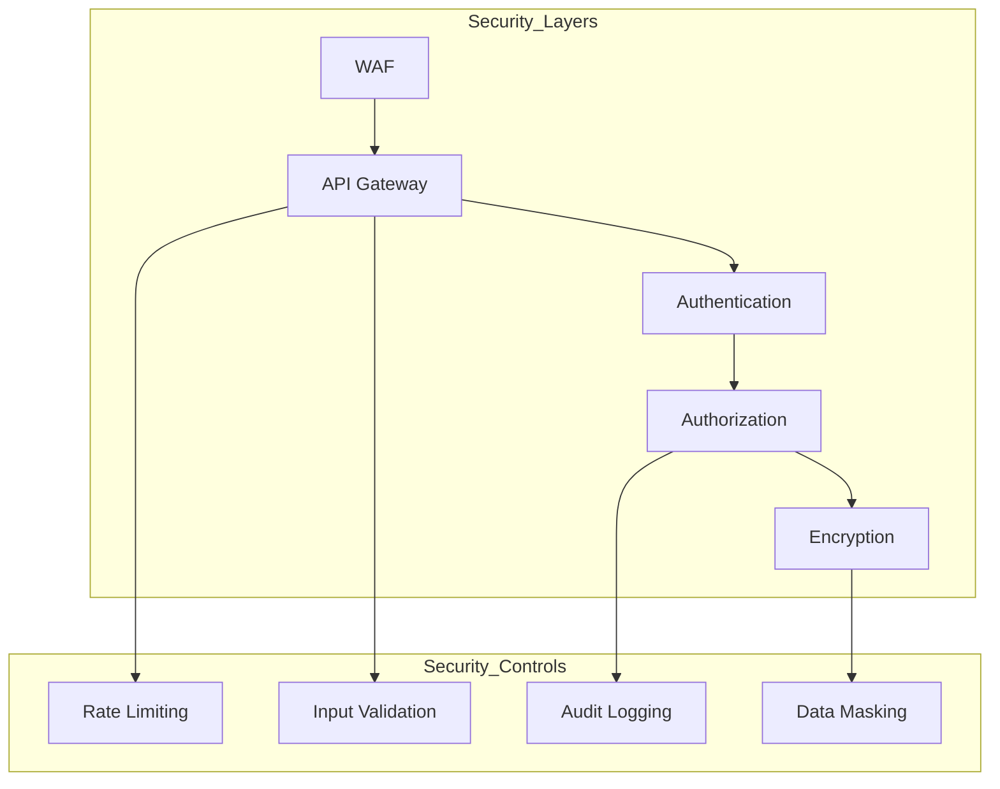

## 2.5 Deployment Architecture

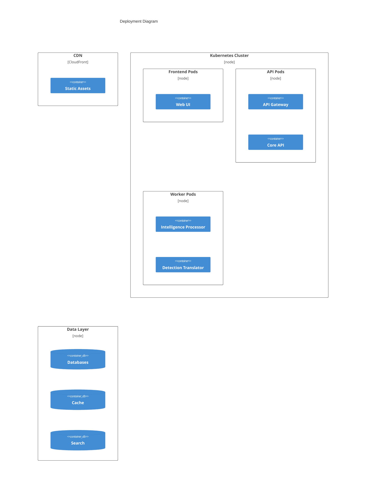

# 3. SYSTEM COMPONENTS ARCHITECTURE

## 3.1 USER INTERFACE DESIGN

### 3.1.1 Design System Specifications

| Component | Specification | Requirements |
|-----------|--------------|--------------|
| Typography | System Font Stack | -Primary: Inter<br>-Fallback: -apple-system, system-ui |
| Color Palette | Material Design 3.0 | -Primary: #1976D2<br>-Secondary: #424242<br>-Error: #D32F2F |
| Spacing System | 8px Base Grid | -Increments: 8px, 16px, 24px, 32px, 48px |
| Breakpoints | Material Design | -Mobile: 0-599px<br>-Tablet: 600-1239px<br>-Desktop: 1240px+ |
| Accessibility | WCAG 2.1 AA | -Contrast ratio: 4.5:1<br>-Focus indicators<br>-Semantic HTML |
| Dark Mode | System Preference | -Auto-detection<br>-Manual toggle<br>-Persistent preference |

### 3.1.2 Layout Structure

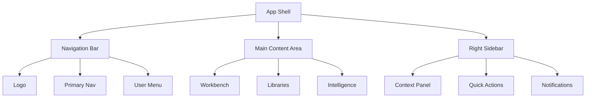

### 3.1.3 Critical User Flows

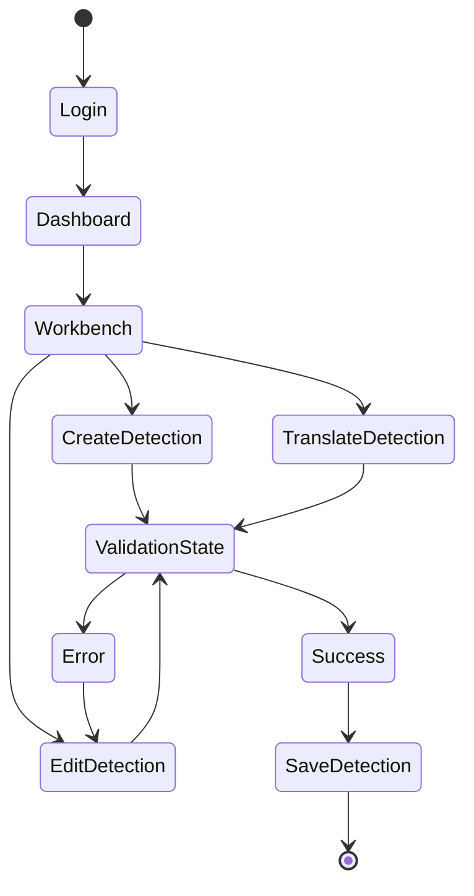

## 3.2 DATABASE DESIGN

### 3.2.1 Schema Design

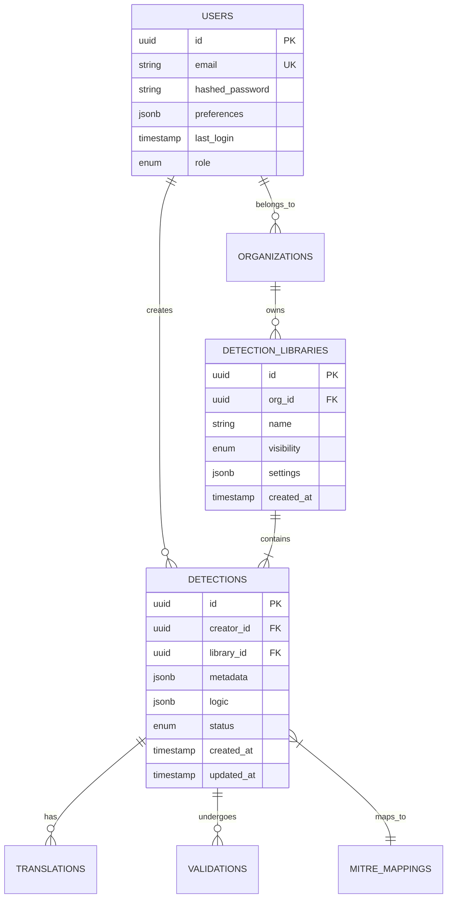

### 3.2.2 Data Management Strategy

| Aspect | Implementation | Details |
|--------|---------------|----------|
| Partitioning | Time-based | Monthly partitions for detections and audit logs |
| Indexing | Composite | Coverage on frequently queried fields |
| Caching | Redis | L2 cache with 15-minute TTL |
| Replication | Multi-AZ | Synchronous replication for primary data |
| Backup | Incremental | Hourly incrementals with daily full backup |
| Retention | Policy-based | 90 days for audit logs, indefinite for detections |

## 3.3 API DESIGN

### 3.3.1 API Architecture

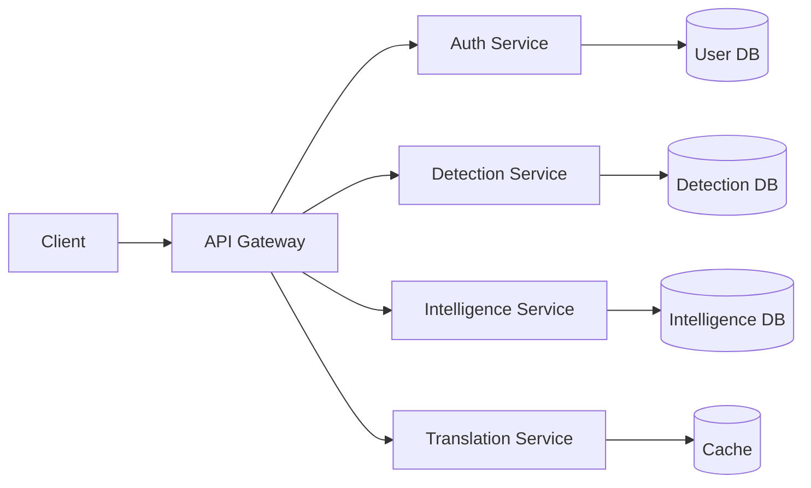

### 3.3.2 Authentication Flow

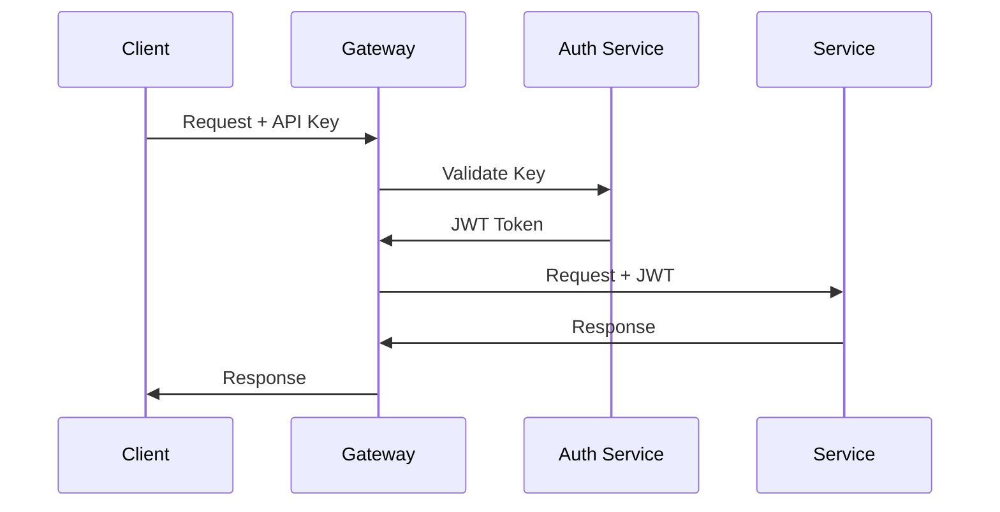

### 3.3.3 API Endpoints

| Endpoint | Method | Description | Rate Limit |
|----------|--------|-------------|------------|
| /api/v1/detections | GET | List detections | 1000/hour |
| /api/v1/detections | POST | Create detection | 100/hour |
| /api/v1/detections/{id} | PUT | Update detection | 100/hour |
| /api/v1/translate | POST | Translate detection | 100/hour |
| /api/v1/intelligence | POST | Process intelligence | 50/hour |

### 3.3.4 Response Format

```json
{
  "status": "success|error",
  "data": {
    "id": "uuid",
    "type": "detection|translation",
    "attributes": {},
    "relationships": {}
  },
  "meta": {
    "timestamp": "ISO8601",
    "version": "string"
  },
  "errors": [{
    "code": "string",
    "title": "string",
    "detail": "string"
  }]
}
```

### 3.3.5 Integration Patterns

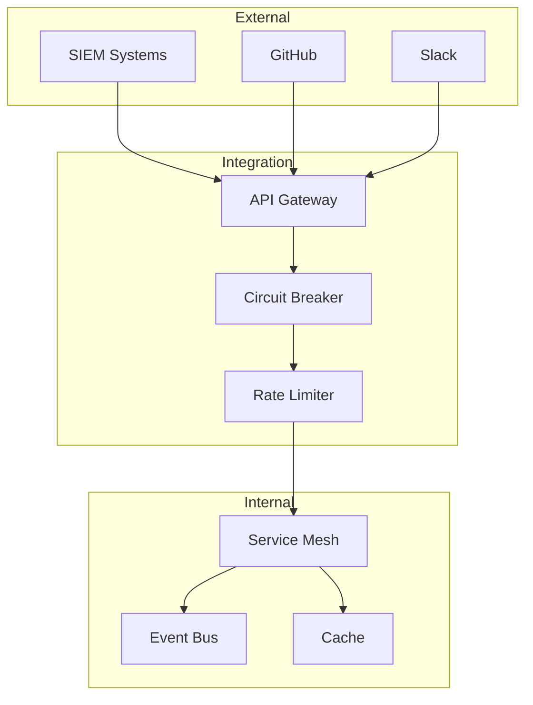

# 4. TECHNOLOGY STACK

## 4.1 PROGRAMMING LANGUAGES

| Platform/Component | Language | Version | Justification |
|-------------------|----------|---------|---------------|
| Backend Services | Python | 3.11+ | - Native AI/ML library support<br>- Strong async capabilities<br>- Extensive security libraries |
| Frontend Web | TypeScript | 5.0+ | - Type safety for large codebase<br>- Enhanced developer productivity<br>- Better maintainability |
| Chrome Extension | JavaScript | ES2022 | - Browser native support<br>- Direct DOM manipulation<br>- WebExtension API compatibility |
| Infrastructure | Go | 1.21+ | - High-performance microservices<br>- Excellent concurrency<br>- Native cloud support |
| Data Processing | Python | 3.11+ | - Rich data processing libraries<br>- ML/AI ecosystem integration<br>- Optimized numeric operations |

## 4.2 FRAMEWORKS & LIBRARIES

### Backend Frameworks

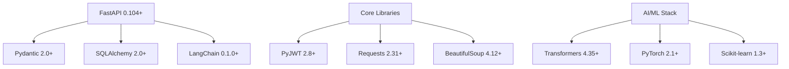

### Frontend Frameworks

| Framework | Version | Purpose | Justification |
|-----------|---------|---------|---------------|
| React | 18.2+ | UI Framework | - Component reusability<br>- Virtual DOM performance<br>- Large ecosystem |
| TailwindCSS | 3.3+ | Styling | - Utility-first approach<br>- Minimal bundle size<br>- Responsive design |
| Redux Toolkit | 1.9+ | State Management | - Predictable state updates<br>- DevTools integration<br>- Middleware support |
| React Query | 4.0+ | Data Fetching | - Server state management<br>- Caching<br>- Real-time updates |

## 4.3 DATABASES & STORAGE

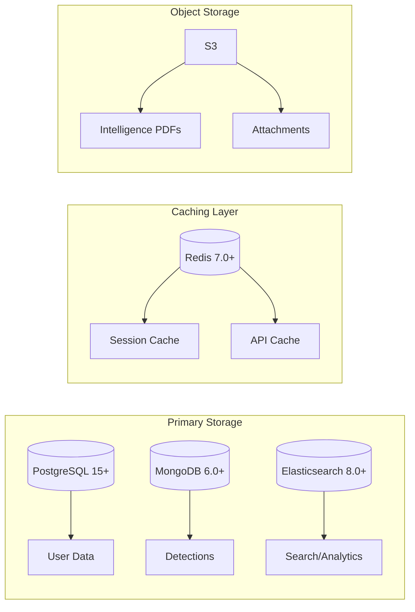

### Storage Strategy Matrix

| Data Type | Storage Solution | Backup Strategy | Retention |
|-----------|-----------------|-----------------|-----------|
| User Data | PostgreSQL | Daily snapshots | Indefinite |
| Detections | MongoDB | Continuous replication | Indefinite |
| Intelligence | S3 + MongoDB | Cross-region replication | 90 days |
| Search Index | Elasticsearch | Daily snapshots | 30 days |
| Cache | Redis | None | 24 hours |

## 4.4 THIRD-PARTY SERVICES

### Integration Architecture

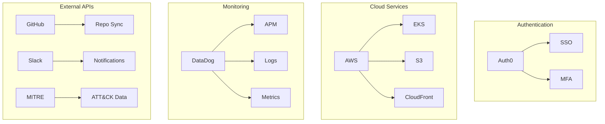

### Service Dependencies

| Service | Version/Tier | Purpose | SLA Requirement |
|---------|-------------|---------|-----------------|
| Auth0 | Enterprise | Authentication | 99.99% |
| AWS | Enterprise | Infrastructure | 99.99% |
| DataDog | Pro | Monitoring | 99.9% |
| GitHub | Enterprise | Version Control | 99.9% |
| Slack | Business+ | Notifications | 99.9% |

## 4.5 DEVELOPMENT & DEPLOYMENT

### Development Pipeline

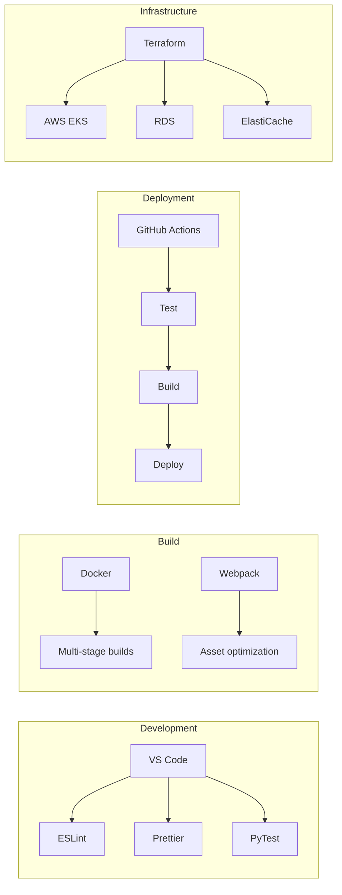

### Tool Requirements

| Category | Tool | Version | Purpose |
|----------|------|---------|----------|
| IDE | VS Code | Latest | Development environment |
| VCS | Git | 2.40+ | Version control |
| Container | Docker | 24.0+ | Application containerization |
| Orchestration | Kubernetes | 1.27+ | Container orchestration |
| IaC | Terraform | 1.6+ | Infrastructure management |
| CI/CD | GitHub Actions | N/A | Automation pipeline |

# 5. SYSTEM DESIGN

## 5.1 USER INTERFACE DESIGN

### 5.1.1 Layout Structure

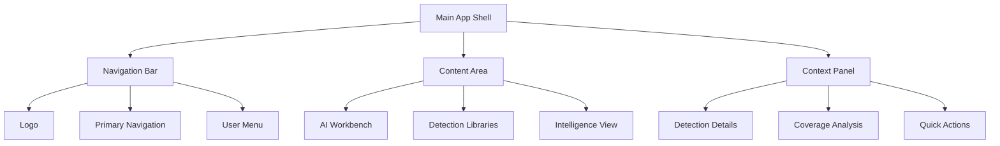

### 5.1.2 Component Layout

| Component | Description | Key Features |
|-----------|-------------|--------------|
| AI Workbench | Split-pane interface with chat and code editor | - Syntax highlighting<br>- Real-time validation<br>- Auto-complete |
| Detection Libraries | Tree-view structure with search | - Drag-and-drop organization<br>- Multi-select actions<br>- Filter controls |
| Intelligence View | Card-based layout with status indicators | - Progress tracking<br>- Batch actions<br>- Preview capability |
| Context Panel | Collapsible side panel | - MITRE mapping visualization<br>- Related detections<br>- Version history |

### 5.1.3 Responsive Breakpoints

| Breakpoint | Width | Layout Adjustments |
|------------|-------|-------------------|
| Desktop | ≥1240px | Full three-column layout |
| Tablet | 600-1239px | Collapsible context panel |
| Mobile | <600px | Single column, modal context |

## 5.2 DATABASE DESIGN

### 5.2.1 Schema Design

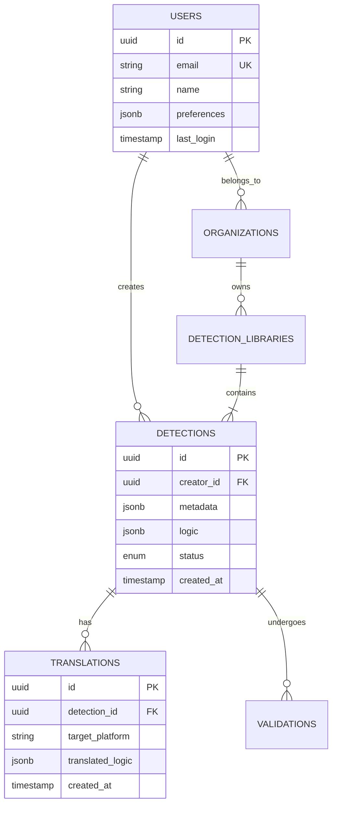

### 5.2.2 Storage Strategy

| Data Type | Storage Solution | Sharding Strategy | Backup Frequency |
|-----------|-----------------|-------------------|------------------|
| User Data | PostgreSQL | None | Daily |
| Detections | MongoDB | By Organization | Hourly |
| Intelligence | MongoDB | By Date | Daily |
| Search Index | Elasticsearch | By Detection Type | Daily |
| File Storage | S3 | By Content Type | Real-time |
| Cache | Redis | By Function | None |

## 5.3 API DESIGN

### 5.3.1 API Architecture

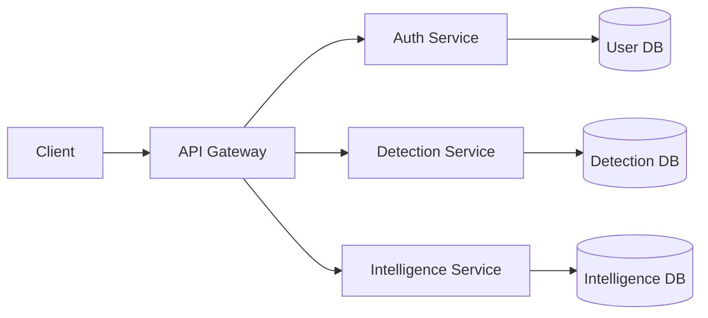

### 5.3.2 Core Endpoints

| Endpoint | Method | Description | Rate Limit |
|----------|--------|-------------|------------|
| /api/v1/detections | GET | List detections | 1000/hour |
| /api/v1/detections | POST | Create detection | 100/hour |
| /api/v1/intelligence | POST | Process intelligence | 50/hour |
| /api/v1/translate | POST | Translate detection | 100/hour |
| /api/v1/coverage | GET | Get coverage analysis | 100/hour |

### 5.3.3 Authentication Flow

```mermaid
sequenceDiagram
    participant C as Client
    participant G as Gateway
    participant A as Auth Service
    participant S as Service
    
    C->>G: Request + API Key
    G->>A: Validate Key
    A->>G: JWT Token
    G->>S: Request + JWT
    S->>G: Response
    G->>C: Response
```

### 5.3.4 WebSocket Events

| Event | Direction | Purpose |
|-------|-----------|---------|
| detection.created | Server→Client | New detection notification |
| intelligence.processed | Server→Client | Processing complete |
| coverage.updated | Server→Client | Coverage changes |
| translation.complete | Server→Client | Translation ready |

### 5.3.5 Error Handling

```json
{
  "status": "error",
  "code": "DETECTION_001",
  "message": "Invalid detection format",
  "details": {
    "field": "logic",
    "reason": "Syntax error in query"
  },
  "timestamp": "2024-01-19T10:00:00Z"
}
```

# 6. USER INTERFACE DESIGN

## 6.1 Layout Components

### 6.1.1 Main Navigation Structure

```
+--------------------------------------------------+
|  [#] AI Detection Platform           [@] [?] [=]  |
+--------------------------------------------------+
|        |                                          |
| +------+                                          |
| | [#] Dashboard                                   |
| | [*] Workbench                                   |
| | [^] Intelligence                                |
| | [=] Libraries                                   |
| | [@] Community                                   |
| |                                                 |
| | --- Teams ---                                   |
| | [+] Add Team                                    |
| | > Team Alpha                                    |
| | > Team Beta                                     |
| |                                                 |
| | --- Settings ---                                |
| | [=] Preferences                                 |
| | [!] Notifications                               |
| | [$] Billing                                     |
| +------+                                          |
|        |                                          |
+--------------------------------------------------+
```

### 6.1.2 AI Workbench Interface

```
+--------------------------------------------------+
|  AI Workbench                       [?] [=] [x]   |
+--------------------------------------------------+
|                                                   |
| +----------------+  +-------------------------+    |
| | Chat History   |  | Detection Editor        |    |
| |                |  |                         |    |
| | You: Create... |  | name: [...............] |    |
| | AI: Here's...  |  | description: [........] |    |
| | You: Modify... |  | +-------------------+   |    |
| | AI: Updated... |  | | Detection Logic   |   |    |
| |                |  | | {...............} |   |    |
| |                |  | +-------------------+   |    |
| |                |  |                         |    |
| | [...........] |  | Coverage:               |    |
| | [Send Message] |  | [==============] 85%    |    |
| +----------------+  |                         |    |
|                    | [Validate] [Translate]   |    |
|                    +-------------------------+    |
+--------------------------------------------------+
```

### 6.1.3 Intelligence View

```
+--------------------------------------------------+
|  Intelligence Sources                [+] [?] [=]  |
+--------------------------------------------------+
|  Filter: [.......] [v] Source Type  [v] Status   |
+--------------------------------------------------+
| +----------------+  +----------------+            |
| | PDF Report     |  | Blog Post     |            |
| | [====] 75%     |  | [====] 100%   |            |
| | 3 Detections   |  | 1 Detection   |            |
| | [View] [Stop]  |  | [View]        |            |
| +----------------+  +----------------+            |
|                                                  |
| +----------------+  +----------------+            |
| | GitHub Repo    |  | URL Feed      |            |
| | [====] 100%    |  | [!] Failed    |            |
| | 12 Detections  |  | 0 Detections  |            |
| | [View]         |  | [Retry]       |            |
| +----------------+  +----------------+            |
+--------------------------------------------------+
```

### 6.1.4 Detection Libraries

```
+--------------------------------------------------+
|  Detection Libraries               [+] [^] [=]    |
+--------------------------------------------------+
| Search: [..............]  [v] Platform  [v] Tags  |
+--------------------------------------------------+
| +-- My Libraries                                  |
|   +-- Enterprise Rules                            |
|     |-- Windows Detections (24)                   |
|     |-- Linux Detections (18)                     |
|     `-- Network Detections (31)                   |
|   +-- Community Shared                            |
|     |-- Public Rules (156)                        |
|     `-- Team Contributions (42)                   |
|                                                   |
| Selected: Windows Detections                      |
| +---------------------+  +--------------------+   |
| | Process Injection   |  | Credential Theft   |   |
| | MITRE: T1055       |  | MITRE: T1003       |   |
| | [*] Featured       |  | [!] Needs Review   |   |
| | [Edit] [Share]     |  | [Edit] [Share]     |   |
| +---------------------+  +--------------------+   |
+--------------------------------------------------+
```

## 6.2 Component Key

### Navigation Icons
- [#] Dashboard/Menu
- [@] User Profile
- [?] Help/Documentation
- [=] Settings
- [+] Add/Create New
- [x] Close/Remove
- [*] Featured/Important
- [!] Warning/Alert
- [^] Upload
- [$] Billing/Payment
- [<] [>] Navigation Controls

### Input Elements
- [...] Text Input Field
- [v] Dropdown Menu
- ( ) Radio Button
- [ ] Checkbox
- [Button] Action Button
- [====] Progress Bar

### Layout Elements
- +--+ Border Container
- |  | Vertical Separator
- +-- Tree View Branch
- --- Section Separator

## 6.3 Responsive Behavior

### Desktop (≥1240px)
- Full three-panel layout
- Expanded navigation
- Side-by-side workbench panels

### Tablet (600-1239px)
```
+--------------------------------------------------+
| [=] AI Detection Platform           [@] [?] [#]   |
+--------------------------------------------------+
|                                                   |
| +--------------------+  [Show/Hide Panels >]      |
| | Collapsed Nav      |                           |
| | [#] [*] [^]       |                           |
| | [=] [@] [!]       |                           |
| +--------------------+                           |
|                                                  |
| [< Content Panel Slides >]                       |
|                                                  |
+--------------------------------------------------+
```

### Mobile (<600px)
```
+--------------------------------------------------+
| [=] AI Platform                     [@] [?] [#]   |
+--------------------------------------------------+
|                                                   |
| [v] Select View                                   |
|                                                   |
| +------------------+                              |
| | Single Panel     |                             |
| | Scrollable View  |                             |
| |                  |                             |
| | [< Back to Menu] |                             |
| +------------------+                              |
|                                                   |
+--------------------------------------------------+
```

## 6.4 Theme Support

### Light Theme Colors
- Background: #FFFFFF
- Primary Text: #2C3E50
- Secondary Text: #7F8C8D
- Accent: #3498DB
- Border: #BDC3C7

### Dark Theme Colors
- Background: #1E1E1E
- Primary Text: #FFFFFF
- Secondary Text: #B2B2B2
- Accent: #3498DB
- Border: #404040

# 7. SECURITY CONSIDERATIONS

## 7.1 AUTHENTICATION AND AUTHORIZATION

### 7.1.1 Authentication Flow

```mermaid
sequenceDiagram
    participant U as User
    participant F as Frontend
    participant G as API Gateway
    participant A as Auth Service
    participant D as Database
    
    U->>F: Login Request
    F->>G: Forward Credentials
    G->>A: Authenticate
    A->>D: Verify Credentials
    D->>A: User Data
    A->>G: Generate JWT
    G->>F: Return Token + Refresh Token
    F->>U: Login Success
```

### 7.1.2 Authentication Methods

| Method | Implementation | Use Case |
|--------|---------------|-----------|
| Username/Password | Argon2id hashing | Primary web login |
| OAuth 2.0 | Auth0 integration | SSO/Enterprise login |
| API Keys | HMAC-SHA256 | API authentication |
| MFA | TOTP (RFC 6238) | Enhanced security |
| Session Tokens | JWT with RS256 | Session management |

### 7.1.3 Authorization Matrix

| Role | Detection Access | Intelligence Access | Admin Functions | API Access |
|------|-----------------|---------------------|-----------------|------------|
| Public User | Read Public | None | None | None |
| Community User | Read/Write Community | Read Community | None | Limited |
| Enterprise User | Full Private | Full Private | Limited | Full |
| Admin | Full System | Full System | Full | Full |

## 7.2 DATA SECURITY

### 7.2.1 Encryption Standards

```mermaid
flowchart TD
    A[Data Types] --> B[Data at Rest]
    A --> C[Data in Transit]
    A --> D[Data in Use]
    
    B --> E[AES-256-GCM]
    B --> F[Volume Encryption]
    
    C --> G[TLS 1.3]
    C --> H[Perfect Forward Secrecy]
    
    D --> I[Memory Encryption]
    D --> J[Secure Enclaves]
```

### 7.2.2 Data Classification

| Classification | Examples | Security Controls |
|----------------|----------|-------------------|
| Public | Public detections, Documentation | Basic encryption |
| Internal | Community detections, Analytics | Encryption + Access controls |
| Confidential | Enterprise detections, User data | Full encryption + Audit logs |
| Restricted | API keys, Authentication tokens | HSM + Enhanced monitoring |

### 7.2.3 Key Management

| Component | Implementation | Rotation Period |
|-----------|---------------|-----------------|
| Master Keys | AWS KMS | 365 days |
| Data Keys | AES-256 | 30 days |
| Session Keys | Ephemeral | 24 hours |
| API Keys | HMAC-SHA256 | On demand |

## 7.3 SECURITY PROTOCOLS

### 7.3.1 Network Security

```mermaid
flowchart LR
    subgraph External
        A[Users]
        B[API Clients]
    end
    
    subgraph Edge
        C[WAF]
        D[DDoS Protection]
        E[API Gateway]
    end
    
    subgraph Internal
        F[Load Balancer]
        G[Application Servers]
        H[Databases]
    end
    
    A --> C
    B --> C
    C --> D --> E
    E --> F --> G --> H
```

### 7.3.2 Security Controls

| Layer | Control | Implementation |
|-------|---------|----------------|
| Network | WAF | AWS WAF with custom rules |
| Application | Rate Limiting | Kong Gateway (1000 req/min) |
| Data | Access Control | RBAC with JWT claims |
| Infrastructure | Container Security | Snyk container scanning |
| Monitoring | Threat Detection | DataDog Security Monitoring |

### 7.3.3 Security Compliance

| Standard | Requirements | Implementation |
|----------|--------------|----------------|
| SOC 2 Type II | Access Control | RBAC + MFA |
| GDPR | Data Privacy | Data encryption + Geographic restrictions |
| HIPAA | Audit Logging | Comprehensive audit trails |
| PCI DSS | Key Management | HSM + Key rotation |

### 7.3.4 Security Monitoring

```mermaid
flowchart TD
    A[Security Events] --> B{Event Type}
    
    B -->|Authentication| C[Auth Monitor]
    B -->|Data Access| D[Access Monitor]
    B -->|API Usage| E[API Monitor]
    
    C --> F[SIEM]
    D --> F
    E --> F
    
    F --> G[Alert Rules]
    G --> H[Security Team]
    G --> I[Automated Response]
```

### 7.3.5 Incident Response

| Phase | Actions | Tools |
|-------|---------|-------|
| Detection | Monitor security events | DataDog Security |
| Analysis | Investigate alerts | ELK Stack |
| Containment | Isolate affected systems | AWS Security Groups |
| Eradication | Remove threat | Automated remediation |
| Recovery | Restore services | Backup restoration |
| Lessons Learned | Update security controls | Security documentation |

# 8. INFRASTRUCTURE

## 8.1 DEPLOYMENT ENVIRONMENT

### Target Environments

| Environment Type | Primary Use | Requirements |
|-----------------|-------------|--------------|
| Production | Live system serving end users | - Multi-region deployment<br>- High availability (99.9%)<br>- Auto-scaling enabled |
| Staging | Pre-production testing | - Production parity<br>- Isolated test data<br>- Feature flags enabled |
| Development | Development and testing | - Local Kubernetes clusters<br>- Mock services<br>- Debug capabilities |

### Environment Architecture

```mermaid
flowchart TD
    subgraph Production
        A[Load Balancer] --> B[API Gateway]
        B --> C[Application Cluster]
        C --> D[Data Layer]
        D --> E[(Primary DB)]
        D --> F[(Replica DB)]
    end
    
    subgraph Staging
        G[Load Balancer] --> H[API Gateway]
        H --> I[Application Cluster]
        I --> J[Data Layer]
    end
    
    subgraph Development
        K[Local K8s] --> L[Minikube]
        L --> M[Local Services]
    end
```

## 8.2 CLOUD SERVICES

### AWS Service Architecture

```mermaid
flowchart LR
    subgraph Compute
        A[EKS] --> B[EC2 Auto Scaling]
    end
    
    subgraph Storage
        C[S3] --> D[EBS]
        D --> E[EFS]
    end
    
    subgraph Database
        F[RDS PostgreSQL] --> G[DocumentDB]
        G --> H[ElastiCache]
    end
    
    subgraph Network
        I[Route53] --> J[CloudFront]
        J --> K[ALB]
    end
```

### Cloud Service Requirements

| Service | Purpose | Configuration |
|---------|----------|--------------|
| AWS EKS | Container orchestration | - Version: 1.27+<br>- Multi-AZ deployment<br>- Managed node groups |
| AWS RDS | Primary database | - PostgreSQL 15+<br>- Multi-AZ deployment<br>- Auto scaling storage |
| AWS DocumentDB | Detection storage | - Version 6.0+<br>- 3 node cluster<br>- Automatic backups |
| AWS ElastiCache | Caching layer | - Redis 7.0+<br>- Cluster mode enabled<br>- Multi-AZ replication |
| AWS S3 | Object storage | - Versioning enabled<br>- Encryption at rest<br>- Cross-region replication |

## 8.3 CONTAINERIZATION

### Container Strategy

```mermaid
flowchart TD
    subgraph Base Images
        A[Python 3.11-slim] --> B[Node 18-alpine]
        B --> C[Go 1.21-alpine]
    end
    
    subgraph Service Containers
        D[API Services] --> E[Worker Services]
        E --> F[Frontend Services]
    end
    
    subgraph Supporting Services
        G[Redis] --> H[MongoDB]
        H --> I[Elasticsearch]
    end
```

### Container Specifications

| Service | Base Image | Resource Limits |
|---------|------------|-----------------|
| API Services | python:3.11-slim | CPU: 2 cores<br>Memory: 4Gi |
| Worker Services | python:3.11-slim | CPU: 4 cores<br>Memory: 8Gi |
| Frontend | node:18-alpine | CPU: 1 core<br>Memory: 2Gi |
| ML Services | python:3.11-cuda | CPU: 4 cores<br>Memory: 16Gi<br>GPU: 1 |

## 8.4 ORCHESTRATION

### Kubernetes Architecture

```mermaid
flowchart TD
    subgraph Control Plane
        A[API Server] --> B[Controller Manager]
        B --> C[Scheduler]
        C --> D[etcd]
    end
    
    subgraph Worker Nodes
        E[Node Pool 1] --> F[Application Pods]
        G[Node Pool 2] --> H[ML Processing Pods]
        I[Node Pool 3] --> J[Worker Pods]
    end
    
    subgraph Services
        K[Ingress] --> L[Service Mesh]
        L --> M[Pod Network]
    end
```

### Kubernetes Resources

| Resource Type | Configuration | Scaling Strategy |
|--------------|---------------|------------------|
| Deployments | - Rolling updates<br>- Resource limits<br>- Health checks | HPA based on CPU/Memory |
| StatefulSets | - Persistent storage<br>- Ordered deployment<br>- Stable network IDs | Manual scaling |
| DaemonSets | - Monitoring agents<br>- Log collectors<br>- Security tools | Node-based |
| Services | - Internal DNS<br>- Load balancing<br>- Session affinity | Load balancer |

## 8.5 CI/CD PIPELINE

### Pipeline Architecture

```mermaid
flowchart LR
    subgraph Source
        A[GitHub] --> B[Feature Branch]
        B --> C[Pull Request]
    end
    
    subgraph CI
        D[GitHub Actions] --> E[Build]
        E --> F[Test]
        F --> G[Security Scan]
    end
    
    subgraph CD
        H[ArgoCD] --> I[Staging]
        I --> J[Production]
    end
    
    C --> D
    G --> H
```

### Pipeline Stages

| Stage | Tools | Actions |
|-------|-------|---------|
| Source Control | GitHub | - Branch protection<br>- Code review<br>- Automated merges |
| Build | GitHub Actions | - Docker builds<br>- Asset compilation<br>- Version tagging |
| Test | PyTest, Jest | - Unit tests<br>- Integration tests<br>- E2E tests |
| Security | Snyk, SonarQube | - Dependency scanning<br>- SAST analysis<br>- Container scanning |
| Deployment | ArgoCD | - GitOps workflow<br>- Automated rollbacks<br>- Deployment strategies |
| Monitoring | DataDog | - Deployment tracking<br>- Performance monitoring<br>- Error tracking |

# 8. APPENDICES

## 8.1 ADDITIONAL TECHNICAL INFORMATION

### 8.1.1 Detection Format Specifications

```mermaid
flowchart TD
    A[Detection Format] --> B[Metadata]
    A --> C[Logic]
    A --> D[Translations]
    A --> E[Validation]
    
    B --> F[ID/Version]
    B --> G[MITRE Mapping]
    B --> H[Author Info]
    
    C --> I[Conditions]
    C --> J[Data Model]
    C --> K[Field Mappings]
    
    D --> L[SIGMA]
    D --> M[KQL]
    D --> N[SPL]
    D --> O[YARA-L]
    
    E --> P[Test Cases]
    E --> Q[Performance]
```

### 8.1.2 Intelligence Processing Capabilities

| Capability | Implementation | Performance Target |
|------------|----------------|-------------------|
| PDF Processing | PyPDF2 + Tesseract OCR | 90% extraction accuracy |
| URL Scraping | BeautifulSoup + Selenium | 95% content capture |
| Image Analysis | TensorFlow Vision API | 85% relevant detail extraction |
| Text Analysis | LangChain + GPT-4 | 2 min processing time |
| Code Extraction | AST Parser + RegEx | 98% syntax preservation |

### 8.1.3 Platform Integration Matrix

| Platform | Authentication | Protocol | Rate Limits |
|----------|----------------|-----------|-------------|
| GitHub Enterprise | OAuth 2.0 | REST/GraphQL | 5000 req/hour |
| Splunk Enterprise | Token-based | REST | 1000 req/min |
| Microsoft Sentinel | Azure AD | REST | 100 req/min |
| Chronicle | Service Account | gRPC | 500 req/min |
| Elastic Security | API Key | REST | 200 req/min |

## 8.2 GLOSSARY

| Term | Definition |
|------|------------|
| Universal Detection Format (UDF) | Standardized JSON schema for cross-platform detection representation |
| Detection Engineering | Process of creating, testing, and maintaining security detection rules |
| Coverage Analysis | Assessment of detection coverage against MITRE ATT&CK framework |
| Intelligence Processing | Automated extraction and analysis of threat intelligence from various sources |
| Detection Translation | Conversion of detection logic between different query languages |
| Community Detection | Publicly shared detection rule with collaborative feedback |
| Field Mapping | Association of data fields between different security platforms |
| Detection Library | Organized collection of detection rules with version control |
| Test Case | Predefined scenario for validating detection effectiveness |
| Platform Translation | Conversion of detection logic to platform-specific format |

## 8.3 ACRONYMS

| Acronym | Full Form |
|---------|-----------|
| API | Application Programming Interface |
| SIEM | Security Information and Event Management |
| UDF | Universal Detection Format |
| CTI | Cyber Threat Intelligence |
| OCR | Optical Character Recognition |
| KQL | Kusto Query Language |
| SPL | Search Processing Language |
| RBAC | Role-Based Access Control |
| JWT | JSON Web Token |
| MFA | Multi-Factor Authentication |
| CI/CD | Continuous Integration/Continuous Deployment |
| GPU | Graphics Processing Unit |
| REST | Representational State Transfer |
| gRPC | Google Remote Procedure Call |
| TLS | Transport Layer Security |
| WAF | Web Application Firewall |
| CDN | Content Delivery Network |
| VCS | Version Control System |
| IDE | Integrated Development Environment |
| TTL | Time To Live |

## 8.4 PERFORMANCE METRICS

| Metric Category | Target | Measurement Method |
|----------------|--------|-------------------|
| API Response Time | < 500ms | 95th percentile |
| Intelligence Processing | < 2 min | Average processing time |
| Translation Accuracy | > 95% | Automated validation |
| System Uptime | 99.9% | Monthly availability |
| Search Performance | < 200ms | Average query time |
| Cache Hit Rate | > 80% | Redis metrics |
| Detection Validation | < 5s | Average validation time |
| UI Responsiveness | < 100ms | Frontend metrics |

## 8.5 ERROR CODES

| Code Range | Category | Example |
|------------|----------|---------|
| 1000-1999 | Authentication | 1001: Invalid credentials |
| 2000-2999 | Detection Processing | 2001: Invalid detection format |
| 3000-3999 | Intelligence Processing | 3001: OCR extraction failed |
| 4000-4999 | Translation | 4001: Unsupported platform |
| 5000-5999 | Integration | 5001: API rate limit exceeded |
| 6000-6999 | Validation | 6001: Test case failed |
| 7000-7999 | Community | 7001: Sharing permission denied |
| 8000-8999 | System | 8001: Service unavailable |